  <picture>
    <source media="(prefers-color-scheme: dark)" srcset="assets/header-dark.svg">
    <source media="(prefers-color-scheme: light)" srcset="assets/header-light.svg">
    
  </picture>

I build the plumbing behind maps at [DaVikingCode](https://github.com/DaVikingCode) — tile servers, caches and pointcloud tooling. TypeScript for the front of the map, Rust and Go for the fast parts underneath.

 

## Stack
|  |  |
|--:|:--|
| **Geospatial** |      |
| **Languages** |     |
| **Runtime & tools** |      |

## Featured projects

<table>
  <tr>
    <td width="50%" valign="top">
      <b><a href="https://github.com/Popoch39/pointcloud-viewer">pointcloud-viewer</a></b> · <code>TypeScript</code> 
      LiDAR point clouds rendered in the browser.
    </td>
    <td width="50%" valign="top">
      <b><a href="https://github.com/Popoch39/maptile_cacher">maptile_cacher</a></b> · <code>Rust</code> 
      Fast caching layer for map tiles.
    </td>
  </tr>
  <tr>
    <td valign="top">
      <b><a href="https://github.com/Popoch39/LasConverter">LasConverter</a></b> · <code>Rust</code> 
      LAS/LAZ pointcloud conversion tooling.
    </td>
    <td valign="top">
      <b><a href="https://github.com/Popoch39/mapproxy">mapproxy</a></b> · <code>Go</code> 
      Map tile proxy server.
    </td>
  </tr>
  <tr>
    <td valign="top">
      <b><a href="https://github.com/Popoch39/claude-tmux-notify.nvim">claude-tmux-notify.nvim</a></b> · <code>Lua</code> 
      Neovim toast when a Claude Code session in another tmux window needs you.
    </td>
    <td valign="top">
      <b><a href="https://github.com/Popoch39/gis_3d">gis_3d</a></b> · <code>TypeScript</code> 
      3D terrain and geodata visualisation experiments.
    </td>
  </tr>
</table>

## Stats

  <picture>
    <source media="(prefers-color-scheme: dark)" srcset="assets/langs-dark.svg">
    <source media="(prefers-color-scheme: light)" srcset="assets/langs-light.svg">
    
  </picture>

 

  47.2378° N · 6.0241° E — <a href="mailto:louis.pocheron@davikingcode.com">louis.pocheron@davikingcode.com</a>

